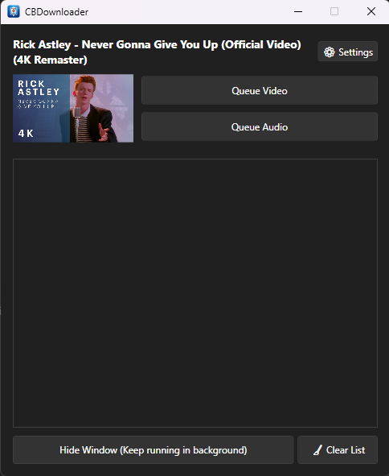

# CBDownloader 📥

CBDownloader is a modern Windows application that automatically detects and downloads videos/audio from **YouTube** and **Instagram** when you copy a link.

## ✨ Features

- **🌒 Aesthetic Dark Mode**: Modern and clean interface.
- **📋 Smart Monitoring**: Detects URLs from your clipboard automatically.
- **🔗 Queue System**: Download multiple items simultaneously.
- **🖼️ Video & Audio**: Save as high-quality MP4 or MP3.
- **🛠️ Self-Maintaining**: Auto-updates dependencies (`yt-dlp` & `ffmpeg`).
- **🏠 Background Mode**: Runs in the system tray for convenience.

## 🚀 Getting Started

### 1. Application Installation
1. Download the latest `CBDownloaderInstaller.exe` from the [Releases](https://github.com/dannydays/ClipBoardDownloader/releases) page.
2. Run the installer and follow the instructions.

### 2. Browser Extension (REQUIRED ⚠️)
The extension is **mandatory** to bypass download restrictions and bot detection. It automatically syncs session cookies to the desktop app and adds native download buttons for convenience.

1. Download the [CBDownloader_Extension.zip](https://github.com/dannydays/ClipBoardDownloader/releases/latest/download/CBDownloader_Extension.zip) from the latest Release.
2. Extract the zip to a folder.
3. Open `chrome://extensions` in your browser (Brave, Chrome, or Edge).
4. Enable **Developer Mode**.
5. Click **Load unpacked** and select the extension folder.

## 📄 License

MIT License - see [LICENSE](LICENSE) for details.