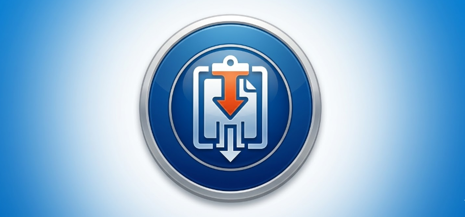
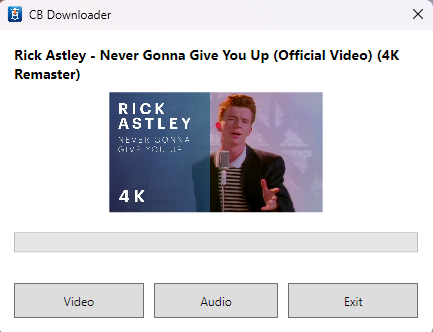

# CBDownloader 📥

CBDownloader is a modern, lightweight Windows application designed to simplify downloading videos and audio from YouTube and Instagram. It automatically monitors your clipboard and triggers when a valid supported link is copied, providing a seamless download experience.

## 🖥️ Preview

## ✨ Features

- **📋 Smart Clipboard Monitoring**: Automatically detects YouTube and Instagram URLs when you copy them.
- **🖼️ Video & Audio Support**: Download high-quality video (MP4) or extract audio (MP3) with one click.
- **⚡ Supercharged Downloads**: Optimized download speeds using concurrent fragment loading.
- **🔄 Auto-Updates**: One-click check to ensure you're always using the latest version.
- **🏠 System Tray Integration**: Runs quietly in the background; accessible via the system tray.
- **🚀 Single Instance**: Prevents multiple windows from cluttering your desktop.
- **🛠️ Self-Maintaining**: Automatically downloads and updates dependencies (`yt-dlp` and `ffmpeg`) as needed.

## 🚀 Getting Started

### Prerequisites

- Windows 10 or 11 (64-bit)

### Installation

1. Download the latest installer from the [Releases](https://github.com/dannydays/ClipBoardDownloader/releases) page.
2. Run `CBDownloaderInstaller.exe`.
3. Choose whether you want the app to start with Windows.

## 🛠️ Built With

- **C# & WPF**: Modern Windows interface.
- **MVVM Toolkit**: Clean and responsive architecture.
- **YoutubeDLSharp**: Seamless integration with `yt-dlp`.
- **Inno Setup**: Professional Windows installation logic.

## 📂 Project Structure

- `CBDownloader/`: Main application source code.
- `installer.iss`: Script for generating the Windows installer.
- `Assets/`: Graphic resources (Icons and images).

## 📄 License

This project is licensed under the MIT License - see the [LICENSE](LICENSE) file for details.